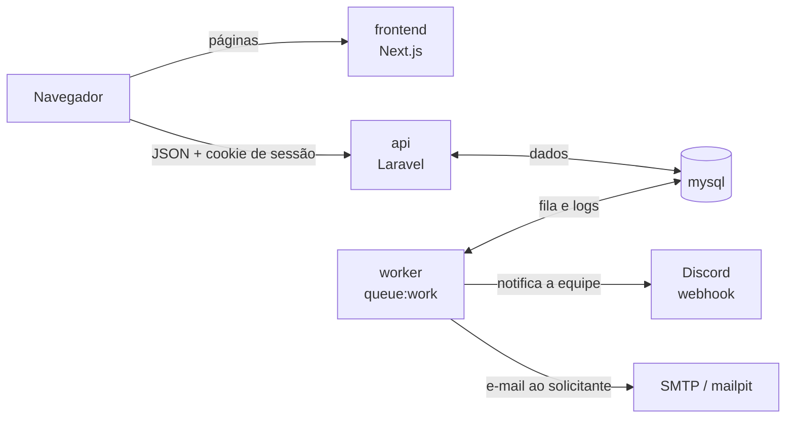

# Containers

O navegador fala com o front-end (Next.js) e chama a API (Laravel) direto. A API grava no MySQL, que também guarda a fila. O `worker` lê a fila e envia as notificações ao Discord e ao servidor SMTP (Mailpit no desenvolvimento).

Decisões: [0004](../adr/0004-sanctum-spa-authentication.md), [0005](../adr/0005-database-queue-and-retries.md), [0006](../adr/0006-docker-compose.md) e [0007](../adr/0007-discord-webhook-and-smtp.md).

