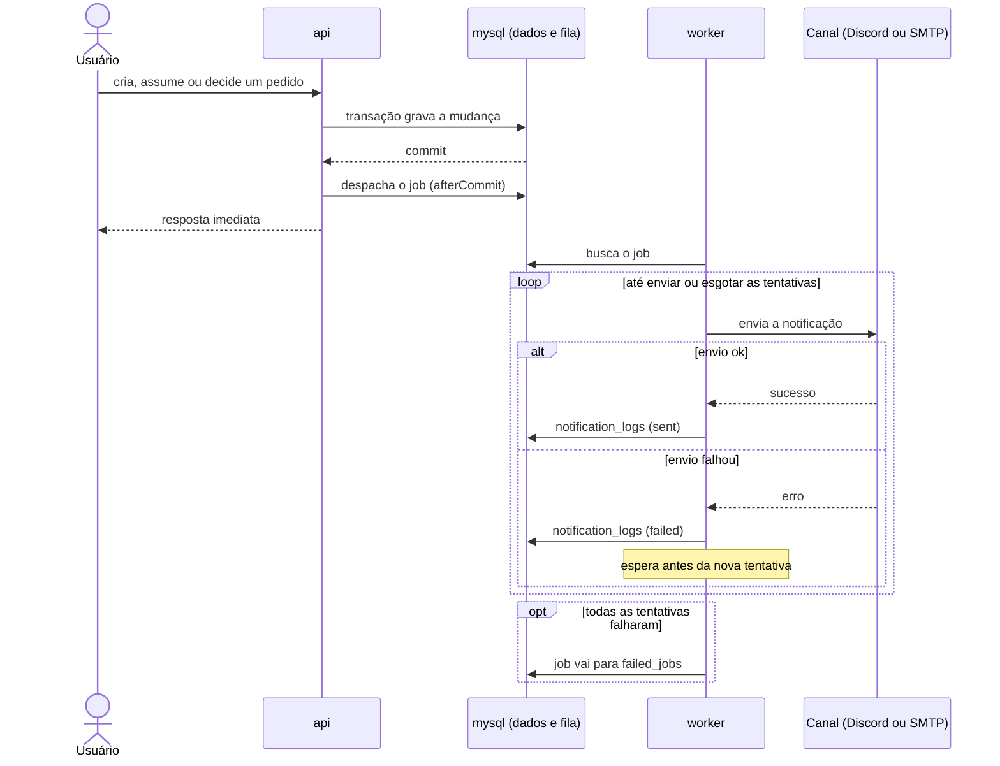

# Notificações

A API grava a ação e, só depois do commit, despacha o job e responde ao usuário na hora. O `worker` envia pelo canal e registra cada tentativa em `notification_logs`; se falhar, tenta de novo com espera crescente; esgotadas as tentativas, o job vai para `failed_jobs`. Número de tentativas e esperas: ADR.

Eventos e canais: fluxo 5 da [PRD](../prd.md). Decisão: [0005](../adr/0005-database-queue-and-retries.md).

