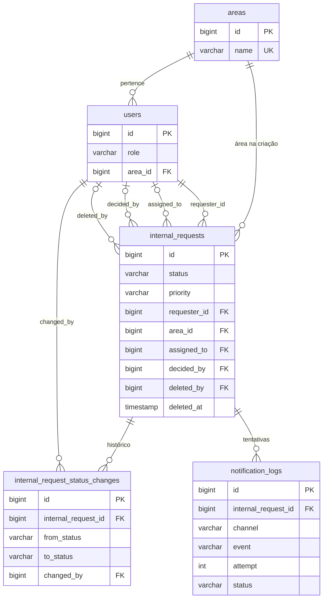

# Modelo de dados

MySQL 8 ([ADR 0003](adr/0003-mysql-database.md)). As regras de negócio estão na [PRD](prd.md); aqui ficam as tabelas e onde cada regra é gravada.

Status, prioridade e perfil são `varchar` convertidos para enums no Laravel. Todas as chaves estrangeiras usam `restrict` ao apagar: nenhum registro referenciado some.

## Tabelas

### `areas`

| Coluna | Tipo | Nulo | Descrição |
|---|---|---|---|
| `id` | bigint | não | Chave primária |
| `name` | varchar | não | Nome da área, único |
| `created_at`, `updated_at` | timestamp | sim | Controle do Laravel |

### `users`

| Coluna | Tipo | Nulo | Descrição |
|---|---|---|---|
| `id` | bigint | não | Chave primária |
| `name` | varchar | não | Nome |
| `email` | varchar | não | E-mail de acesso, único |
| `password` | varchar | não | Senha com hash |
| `role` | varchar | não | `requester`, `analyst` ou `admin` |
| `area_id` | bigint | não | Área atual da pessoa (FK `areas`) |
| `remember_token` | varchar | sim | Usado por "Mantenha-me conectado" |
| `created_at`, `updated_at` | timestamp | sim | Controle do Laravel |

### `internal_requests`

| Coluna | Tipo | Nulo | Descrição |
|---|---|---|---|
| `id` | bigint | não | Chave primária |
| `title` | varchar(255) | não | Título |
| `description` | text | não | Descrição |
| `priority` | varchar | não | `low`, `medium` ou `high` |
| `status` | varchar | não | `open`, `in_review`, `approved` ou `rejected` |
| `requester_id` | bigint | não | Quem pediu (FK `users`) |
| `area_id` | bigint | não | Área do solicitante copiada na criação (FK `areas`) |
| `assigned_to` | bigint | sim | Quem assumiu (FK `users`) |
| `assigned_at` | timestamp | sim | Quando foi assumido |
| `decided_by` | bigint | sim | Quem decidiu (FK `users`) |
| `decided_at` | timestamp | sim | Quando foi decidido |
| `decision_justification` | text | sim | Justificativa da decisão |
| `deleted_by` | bigint | sim | Quem excluiu (FK `users`) |
| `created_at`, `updated_at` | timestamp | sim | Controle do Laravel |
| `deleted_at` | timestamp | sim | Exclusão lógica |

Índices: `status`, `priority`, `requester_id` e `created_at`.

### `internal_request_status_changes`

| Coluna | Tipo | Nulo | Descrição |
|---|---|---|---|
| `id` | bigint | não | Chave primária |
| `internal_request_id` | bigint | não | Pedido (FK `internal_requests`) |
| `from_status` | varchar | sim | Status anterior; nulo na criação |
| `to_status` | varchar | não | Novo status |
| `changed_by` | bigint | não | Quem mudou (FK `users`) |
| `created_at` | timestamp | não | Quando mudou |

### `notification_logs`

| Coluna | Tipo | Nulo | Descrição |
|---|---|---|---|
| `id` | bigint | não | Chave primária |
| `internal_request_id` | bigint | não | Pedido (FK `internal_requests`) |
| `channel` | varchar | não | `discord` ou `mail` |
| `event` | varchar | não | `created`, `assigned` ou `decided` |
| `attempt` | int | não | Número da tentativa (limite no [ADR 0005](adr/0005-database-queue-and-retries.md)) |
| `status` | varchar | não | `sent` ou `failed` |
| `error` | text | sim | Mensagem de erro, quando falhou |
| `created_at` | timestamp | não | Quando ocorreu |

### Tabelas do Laravel

`sessions`, `jobs`, `failed_jobs` e `cache`: sessão, fila ([ADR 0005](adr/0005-database-queue-and-retries.md)) e cache do framework. `password_reset_tokens`: tokens da recuperação de senha (Fase 3).

## Onde cada regra é gravada

| Regra da PRD | Como é gravada |
|---|---|
| Solicitante, data e status inicial (fluxo 2) | `requester_id`, `created_at` e `status = open` preenchidos pelo sistema |
| Área gravada como no dia do pedido | `internal_requests.area_id` copiado de `users.area_id` na criação; não acompanha mudanças posteriores |
| Solicitante vê só os seus pedidos | Filtro por `requester_id` |
| Pedido excluído some mas fica para auditoria | `deleted_at` (exclusão lógica) e `deleted_by`; as consultas e o painel ignoram esses registros |
| Quem assumiu e quando (fluxo 3) | `assigned_to` e `assigned_at` no próprio pedido (relação 1:1) |
| Decisão, justificativa, data e autor | `decided_by`, `decided_at` e `decision_justification` no pedido |
| Decisão definitiva | Só se decide um pedido `in_review`; depois, o status não aceita nova mudança |
| Sem assumir duas vezes, nem editar ou excluir durante uma decisão | Assumir, decidir, editar e excluir usam atualização condicional dentro de uma transação, por exemplo `UPDATE ... WHERE status = 'open' AND deleted_at IS NULL`; se nenhuma linha for afetada, a API responde `409` |
| Histórico de cada mudança de status | Uma linha em `internal_request_status_changes` por mudança; a criação registra `from_status` nulo e `to_status = open` |
| Painel por status e prioridade (fluxo 4) | Contagem por `status` e `priority`, usando os índices |
| Pesquisa por texto | `LIKE` em `title` e `description` |
| Tentativas de notificação (fluxo 5) | Uma linha em `notification_logs` por tentativa, com sucesso ou falha |
| Sessão e bloqueio de login (fluxo 1) | `sessions` e `remember_token`; o bloqueio usa o cache ([ADR 0004](adr/0004-sanctum-spa-authentication.md)) |
